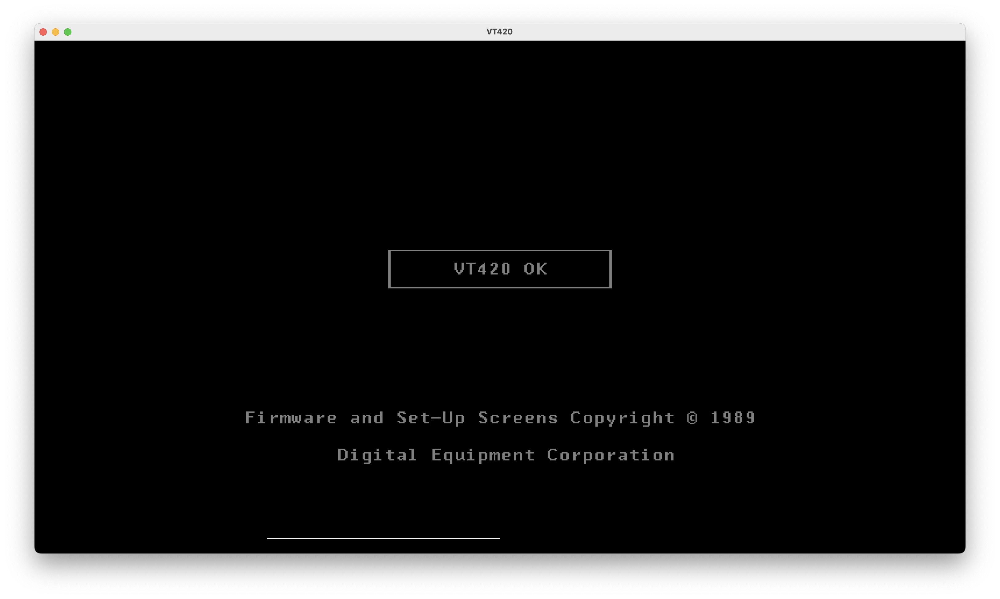
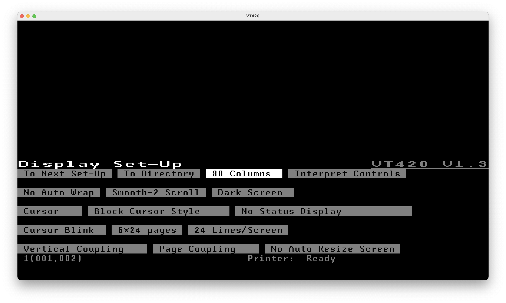

# Blaze: an emulator for the VT420 terminal

Blaze is an emulator for the VT420 terminal. It is a work in progress and is not
yet complete.

It is build on top of [the i8051 emulator crate](https://crates.io/crates/i8051).

The emulator includes a debugger and TUI for running the emulator with an
emulated display and keyboard.

## Features

Emulates the VT420 terminal:
  - LK201 keyboard
  - DC7166B/DC7166C video processor
  - 8051 CPU
  - 5911 EEPROM
  - DUART

## Screenshots

Graphical UI:




Textual UI:


## Quick Start

```
# Run the emulator with a graphical display and comm1/2 in loopback mode
cargo run --all-features --release -- --rom roms/vt420/23-068E9-00.bin --display=graphics

# Run the emulator with a graphical display and comm1 connected to "/bin/sh"
cargo run --all-features --release -- --rom roms/vt420/23-068E9-00.bin --display=graphics --comm1-exec "/bin/sh"

# Run the emulator with a text display and comm1 connected to "/bin/sh"
cargo run --all-features --release -- --rom roms/vt420/23-068E9-00.bin --display=text --comm1-exec "/bin/sh"
```

Input is still a work in progress, but the following keys are supported:

Supported input keys:
 - Standard text-printing characters
 - Special keys:
   - F1-F5
   - Up, Down, Left, Right
   - Enter
   - Escape

Emulator control keys (text displaymode only):
 - Ctrl+G: Enter command mode
  - Q: Quit (or Ctrl+F, then Q)
  - (1,2,3,4,5): Send F1-F5 if your terminal doesn't support them
  - D: Dump VRAM to /tmp/vram.bin
  - H: Toggle hex display mode for VRAM
  - Space: Toggle running/pausing

`--show-vram` and `--show-mapper` can be used to display the first 256 bytes of
the video RAM and mapper registers in real time while `--display` is enabled.

`--log` and `-v` will output trace messages to /tmp/blaze-vt.log.

## Debugging

Debugging is mutually exclusive with displaying the video RAM at this time.

Breakpoints can be preset from the command-line as hex addresses or toggled
during execution.

```
# Set breakpoints at ABCD and 1ABCD
cargo run --release -- --rom roms/vt420/23-068E9-00.bin --debug --trace -v --bp ABCD --bp 1ABCD
```

Breakpoint addresses are not currently documented, but you may be able to find
some interesting ones by looking in [`src/main.rs`](src/main.rs) at this time.

Alternatively, you can run headlessly and use --trace which is useful in some
cases:

```
# cargo run --release -- --rom roms/vt420/23-068E9-00.bin --trace -v
VT420 Emulator starting...
ROM file: "roms/vt420/23-068E9-00.bin"
Initializing 8051 CPU emulator...
Starting CPU execution...
Loading ROM into memory...
CPU initialized, PC = 0x0000
[BP] Interrupt: CPU reset
NVR: chip select rising edge
NVR: clock tick, DI = 1
Mapper write: 0x7FF0 = 0x00 -> 0x00 @ 00142
Mapper write: 0x7FF1 = 0x00 -> 0x00 @ 00144
Mapper write: 0x7FF2 = 0x00 -> 0x00 @ 00146
...
```

## Disassembling the ROM

There is a WIP VT420 disassembly in Ghidra, but this is not yet published.
