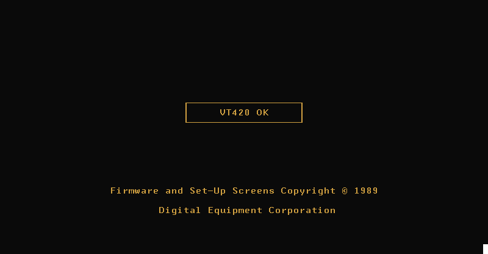
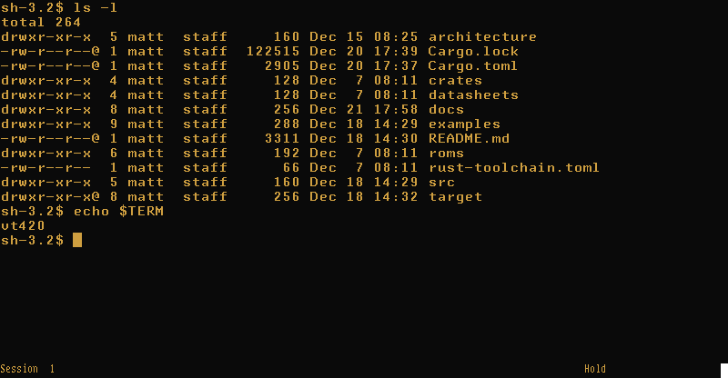

# Blaze: an emulator for the VT420 terminal

Blaze is an emulator for the VT420 terminal.

Try it out in the browser! [https://mmastrac.github.io/blaze/](https://mmastrac.github.io/blaze/)

The emulator includes a graphical mode supporting WGPU and OpenGL, a headless
mode, and a debugger/TUI for running the emulator with an emulated display and
keyboard.

Blaze is built on top of [the i8051 emulator
crate](https://crates.io/crates/i8051).

## Features

Emulates the VT420 terminal:

- LK201 keyboard
- DC7166B/DC7166C video processor, including:
  - Smooth scrolling
  - Multi-session support
  - 80/132-column support
  - Custom fonts
- 8051 CPU
- 5911 EEPROM
- DUART

## Screenshots

Graphical UI:

 

Textual UI:


## Quick Start

```
# Run the emulator with a graphical display and comm1/2 in loopback mode
cargo run --all-features --release -- --display=graphics

# Run the emulator with a graphical display and comm1 connected to "/bin/sh"
cargo run --all-features --release -- --display=graphics --comm1 'exec /bin/sh'

# Run the emulator with a text display and comm1 connected to "/bin/sh"
cargo run --all-features --release -- --display=text --comm1 'exec /bin/sh'

# Run the emulator in WASM and display the video output in a browser
cargo run-wasm --bin blaze-vt --no-default-features --features=wasm,demo --release
```

Input is still a work in progress, but the following keys are supported:

Supported input keys:

- Standard text-printing characters
- Special keys:
  - F1-F5
  - Up, Down, Left, Right
  - Enter
  - Escape

Emulator control keys (text display-mode only):

- Ctrl+G: Enter command mode
- Q: Quit (or Ctrl+F, then Q)
- (1,2,3,4,5): Send F1-F5 if your terminal doesn't support them
- D: Dump VRAM to /tmp/vram.bin
- H: Toggle hex display mode for VRAM
- Space: Toggle running/pausing

`--show-vram` and `--show-mapper` can be used to display the first 256 bytes of
the video RAM and mapper registers in real time while `--display` is enabled.

`--log` and `-v` will output trace messages to /tmp/blaze-vt.log.

## Debugging

Debugging is mutually exclusive with displaying the video RAM at this time.

Breakpoints can be preset from the command-line as hex addresses or toggled
during execution.

```
# Set breakpoints at ABCD and 1ABCD
cargo run --release -- --rom roms/vt420/23-068E9-00.bin --debug --trace -v --bp ABCD --bp 1ABCD
```

Breakpoint addresses are not currently documented, but you may be able to find
some interesting ones by looking in [`src/main.rs`](src/main.rs) at this time.

Alternatively, you can run headlessly and use --trace which is useful in some
cases:

```
# cargo run --release -- --rom roms/vt420/23-068E9-00.bin --trace -v --display=headless
VT420 Emulator starting...
ROM file: "roms/vt420/23-068E9-00.bin"
Initializing 8051 CPU emulator...
Starting CPU execution...
Loading ROM into memory...
CPU initialized, PC = 0x0000
[BP] Interrupt: CPU reset
NVR: chip select rising edge
NVR: clock tick, DI = 1
Mapper write: 0x7FF0 = 0x00 -> 0x00 @ 00142
Mapper write: 0x7FF1 = 0x00 -> 0x00 @ 00144
Mapper write: 0x7FF2 = 0x00 -> 0x00 @ 00146
...
```

## License

Blaze is licensed under the GNU Affero General Public License, version 3
(AGPL-3.0). This program is free software: you can redistribute it and/or modify
it under the terms of the AGPL as published by the Free Software Foundation,
either version 3 of the License, or (at your option) any later version.

To clarify the project’s intended use, Blaze may be used unmodified as a
standalone component -- such as a WebAssembly (WASM) module or independently
executed program -- without imposing AGPL licensing requirements on other
software that merely uses or interacts with Blaze, provided that Blaze remains
clearly separable and is not combined into a single program with that software.

This clarification does not alter the requirement to provide the complete
corresponding source code for Blaze itself in accordance with the AGPL.

Any modification of Blaze, or any use that results in Blaze being combined into
or linked with other code to form a derivative work, remains subject to the full
terms of the AGPL.

See the [AGPL-3.0.txt](AGPL-3.0.txt) file for the full license text.

### Supporting Libraries

Most supporting libraries for Blaze are licensed under a dual MIT/Apache-2.0
license. Please consult each library's `LICENSE` file(s) for the full license
text.

## Disassembling the ROM

There is a WIP VT420 disassembly in Ghidra, but this is not yet published.
