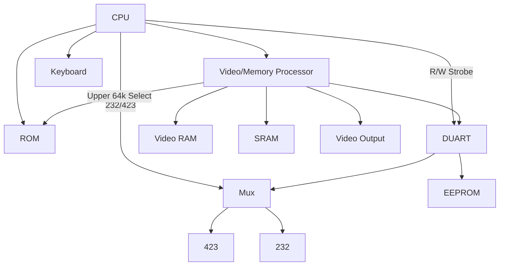

# Architecture

## Components

 - CPU: 8051
 - ROM: 128kB (128k x 8bit)
 - Video/Memory Processor: DC7166B/DC7166C (custom part)
 - Video RAM: 128kB (dual-ported VRAM 256k x 4bit) OR 32kB VRAM + 32kB DRAM (64k x 4bit)
 - RAM: 32kB (32k x 8bit)
 - UART: 2681 DUART
 - UART Mux: 74LS157 (2 to 1 mux)
 - EEPROM: 5911 (128 x 8 or 64 x 16 serial EEPROM)
 - Keyboard: LK201/LK401

## CPU Ports

P1:

 - 7: Unused (doesn't match schematic)
 - 6: Program Enable (active low) - worldwide vs north american setting
 - 5: 232/423 Select (active high)
 - 4: DUART Reset (active high)
 - 0-3: Rotation Control (active high)

P2:

 - 0-7: Zero-page upper address bits 

P3:

 - 7: CPU Read Strobe (DUART, active low)
 - 6: CPU Write Strobe (DUART, active low)
 - 5: 60/70 Hz frame rate select (active high): connected to TEA2037A frame oscillator circuit (NOT used as timer/counter)
 - 4: CSYNC (VSYNC|HSYNC,active low) input: also connected to TEA2037A video input circuit (used as timer/counter input)
 - 3: DUART interrupt (active low)
 - 2: Memory Processor interrupt (active low): works like a CPU hold
 - 1: Keyboard TX
 - 0: Keyboard RX

## Memory Map

 - 0x0000-0x7fdf: VRAM (Addressable via "zero page" + P2 as well)
 - 0x7eXX-0x????: Possibly a mirror for the registers at 0x7ff0-0x7fff
 - 0x7fe0-0x7fef: DUART
 - 0x7ff0-0x7fff: Memory Processor Control
 - 0x8000-0xffff: SRAM

## DUART Ports

Port A:
 - Printer Receive/Transmit

Port B:
 - DUART Receive/Transmit (muxed to 232/423)

Input:

 - 6: Carrier Detect (active low)
 - 5: Printer Data Set Ready (active low)
 - 4: EEPROM Ready (active high)
 - 3: EEPROM Receive (active high)
 - 2: Speed Indicator (active low)
 - 1: Data Set Ready (active low)
 - 0: Clear to Send (active low)

Output:

 - 7: Printer Data Transmit Ready (active low)
 - 6: EEPROM Transmit (active high)
 - 5: EEPROM Clock (active high)
 - 4: EEPROM Chip Select (active high)
 - 3: Data Terminal Ready 2 (active low)
 - 2: Speed Select (active high)
 - 1: Data Terminal Ready 1 (active low)
 - 0: Ready To Send (active low)

## Memory Mapping Registers

 - 0x7ee4/0x7ee5: 16-bit register, copied to 0x7ff6 in two writes
 - 0x7ee6/0x7ee7: 16-bit register, copied to 0x7ffc in two writes

 - 0x7ef3:
  - `...._..xx` => x = VRAM page?
  - `...._.x..` => CMNCLK?
 - 0x7ef4: (same as 7ef3 but for session 2)
  - `...._..xx` => x = VRAM page?
  - `...._.x..` => CMNCLK?

 - 0x7ff3:
  - Set to `1010_0000` and then a delay - `1..._....` may be a reset
  - `..x._....` => VRAM page mapped at 0x8000?
  - `...x_....` => x = Some sort of swizzle? Could be used to quickly swap registers. Used for session flipping.
  - `...._..x.` => possibly invert
  - `...._...x` => 1 = 132 columns, 0 = 80 columns
  
 - 0x7ff4:
  - `x..._....` => 1 = 70Hz (70Hz ~14.29ms/frame, 536 lines), 0 = 60Hz (60Hz ~16.67ms/frame, 625 lines) (CONFIRMED via ROM disassembly)
  - `.x.x_....` => 01 = normal VRAM layout? 11 = alternate VRAM layout? (memory existance is tested in bootstrap, 11 is set if not there)
  - `...._..xx` => possibly invert/width
  - `...._x...` => possibly page flip control?
  
 - 0x7ff5:
  - `.x.._....` => x = alternate RAM layout?
  - `..x._....` => x = 0 = force SRAM mapping?
  - `...x_x...` => x = VRAM page select?
  - `...._.x..` => x = ROM bank select (CONFIRMED via ROM disassembly)
  
 - 0x7ff6: 16-bit register, written twice
